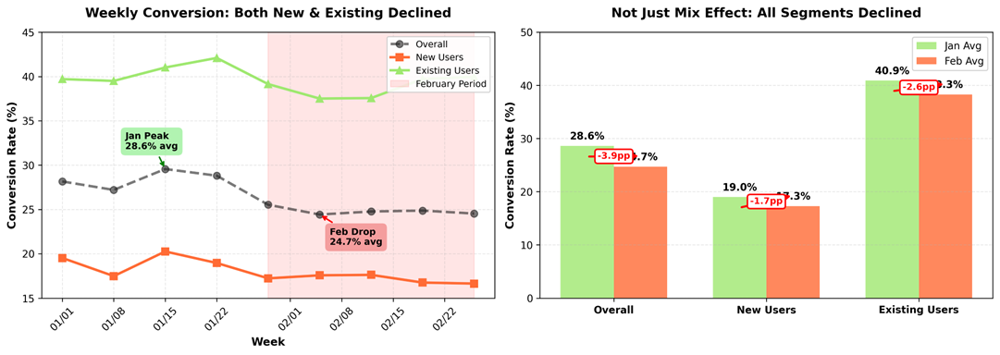

# MXN→USD Route Launch - Case Study

**Goal:** Evaluate route viability and diagnose Q1 2024 performance  
**Period:** January - March 2024  
**Analyst:** Product Analyst Case Study

---

## Executive Summary

**Finding:** New users drive 62.7% of volume but convert at 18.6% vs 38.2% for Existing users (19.6pp gap).

**Root Cause:** Payment step (Created→Funded) - New users at 34.9% vs Existing at 60.9% (26pp gap).

**Impact:** Improving New user payment experience from 34.9% to 47.9% (50% gap closure) yields +1,602 transfers (+15.2% total volume).

**Decision:** Route is viable. Focus on New user payment experience optimization.

---

## Part 1: Demand Estimation

### Methodology

**Top-Down Market Sizing:**
- TAM: $60B Mexico→US remittance corridor (World Bank)
- Digital addressable: ~$16.5B (conservative 27.5% digital adoption)
- Wise SAM: $6.6B (40% of digital - banked, tech-savvy, regular senders)
- Year 1 target: 1.5% market share = ~$99M TPV

**Bottom-Up Validation:**

*Note: Requires internal Wise data not accessible as external candidate. Methodology shown below.*

Key signals to quantify (would request from Wise team):
1. **MXN users attempting USD flows:** Search queries for "MXN USD" in app, support tickets requesting route, blocked transaction attempts
2. **Reverse-flow needs:** % of USD→MXN users who also need to send MXN→USD (bi-directional flow pattern from other corridors)
3. **Existing MXN base:** Users with MXN balances who cannot currently send to USD (pent-up demand)
4. **Benchmark conversion rates:** BRL→USD, CLP→USD, ARS→USD Year 1 performance (to estimate realistic conversion assumptions)

Expected calculation:
- Addressable users (from signals 1-3) × Conversion rate (from signal 4) × Transactions/user × Avg ticket
- Cross-validate with top-down estimate

Convergence: If both methods align within 10-20%, confidence is high. Target: ~$90-100M Year 1.

### Success Metrics Framework

**North Star:** Total Payment Volume (TPV)
- Target: $90M Year 1 (conservative)
- Minimum viable: $70M (break-even threshold)

**Primary Drivers:**

These metrics directly cause the North Star (TPV). If these perform well, volume follows naturally.

- **Overall Conversion Rate (Created → Transferred):** % of users who complete the full funnel
  - *Why it matters:* Direct indicator of product-market fit and user experience quality
  - *How to set target:* Benchmark against comparable LatAm routes (BRL, CLP, ARS Year 1 performance), adjust for market competition and Wise product maturity
  
- **Route Adoption Rate:** % of eligible users who create at least one MXN→USD transfer
  - *Why it matters:* Shows whether users are trying the route at all (demand validation)
  - *How to set target:* Analyze reverse-flow patterns (USD→MXN users) and similar route launch adoption curves
  
- **Repeat Usage Rate (30 days):** % of users who make 2+ transfers within 30 days
  - *Why it matters:* Remittances are recurring by nature. Low repeat rate signals friction or mismatch with user needs
  - *How to set target:* Benchmark against industry (traditional remittance providers repeat behavior) and Wise's other remittance routes

*Note: Specific numerical targets require internal benchmark data. Framework above shows the methodology for setting defensible targets.*

**Leading Indicators:**
- 7-day new user conversion
- Created→Funded rate (payment step health)
- Funded→Transferred rate (operational quality)

**Targets contingent on internal benchmarks** - exact numbers require BRL→USD, CLP→USD performance data.

### Go/No-Go Decision

**Recommendation:** PROCEED

**Rationale:**
- Market size justifies investment ($60B corridor)
- Conservative estimate ($90M) exceeds break-even ($70M)
- Strategic fit: Completes LatAm coverage, natural pairing with USD→MXN

---

## Part 2: Q1 2024 Performance Analysis

### Actual Results

**Overall Funnel:**
- Users created transfer: 40,223
- Users funded transfer: 18,195 (45.2%)
- Completed transfers: 10,557 (26.2% overall conversion)

**Q1 Performance:**
- User volume: 40K users in 2 months (strong market demand)
- Conversion: 26.2% overall (investigation reveals New vs Existing gap as primary driver)

### Weekly Performance Trend



**Observation:** Both New and Existing users declined in February. New users dropped from 19.0% to 17.3% (-1.7pp), while Existing users dropped from 40.9% to 38.3% (-2.6pp). Not just mix effect - suggests systemic issue affecting all user types.

---

## Root Cause Analysis

### Hypothesis Testing

Tested three dimensions to identify the primary driver of conversion performance.

**Methodology:** Calculate conversion rate variance across each dimension. Higher variance = stronger driver.

*Conversion Range = Difference between highest and lowest performing segment within a dimension. Large range indicates that dimension significantly impacts conversion.*

**Results by dimension:**

| Dimension | Segments Tested | Lowest Conv. | Highest Conv. | Range | Assessment |
|-----------|----------------|--------------|---------------|-------|------------|
| **User Experience** | New vs Existing | 18.6% | 38.2% | **21.8pp** | **Primary driver** |
| Region | LatAm, NorthAm, Other | 22.8% | 33.2% | 10.4pp | Secondary |
| Platform | Android, Web, iOS | 22.7% | 31.6% | 9.0pp | Secondary |

**Conclusion:** User Experience shows 2-3x more variance than Region or Platform. New vs Existing is the primary driver.

---

### Funnel Breakdown: New vs Existing

| Stage | New Users | Existing Users | Gap |
|-------|-----------|----------------|-----|
| Created→Funded | 34.9% | 60.9% | **26.0pp** |
| Funded→Transferred | 51.0% | 64.3% | 13.2pp |
| **Overall** | **18.6%** | **38.2%** | **19.6pp** |

**Root Cause:** Payment step (Created→Funded) has 2x larger gap than payout step.

---

### Validation: Regional Cross-Check

**Question:** Looking at the overall segment performance, LatAm shows the lowest Created→Funded rate (32.9%) among all regions. Could the "New vs Existing" finding actually be a regional issue in disguise?

**Overall regional performance:**
- Other: 56.5% Created→Funded, 33.2% overall conversion
- NorthAm: 50.8% Created→Funded, 22.8% overall conversion  
- LatAm: 32.9% Created→Funded, 25.5% overall conversion

**Hypothesis to test:** Is LatAm's poor performance driving the New vs Existing gap, or does the gap exist independently across all regions?

**Test:** Cross-analyze Region × User Experience to see if New vs Existing gap persists in each region.

**Result:** New vs Existing gap exists consistently across all regions:

| Region | New C→F | Existing C→F | Gap |
|--------|---------|--------------|-----|
| LatAm | 17.8% | 50.8% | 33.0pp |
| NorthAm | 45.0% | 74.2% | 29.1pp |
| Other | 39.5% | 68.5% | 29.0pp |

**Validation:** Pattern is consistent (~29-33pp gap everywhere). User Experience is primary; Region is secondary.

---

## Business Impact Scenarios

**Assumption:** Improve only Created→Funded for New users. Payout step remains constant.

| Scenario | Target C→F | Overall Conv. | Additional Transfers | Impact |
|----------|-----------|---------------|---------------------|--------|
| Conservative (30%) | 42.9% | 21.9% | +1,007 | +9.5% |
| **Base Case (50%)** | **48.3%** | **24.6%** | **+1,678** | **+15.9%** |
| Optimistic (70%) | 53.6% | 27.4% | +2,350 | +22.3% |
| Best Case (100%) | 61.6% | 31.4% | +3,357 | +31.8% |

**Base Case recommendation:** 50% gap closure through simplified payment flow + trust signals + guided onboarding.

---

## Recommendations

### Priority 1: Optimize New User Payment Experience

**Problem:** 26pp gap at Created→Funded step.

**Actions:**
1. Investigate friction points: Run session replay analysis on abandoned payment flows
2. Test solutions: Simplified payment UX, trust signals (security badges), guided onboarding for first-time users
3. Add local payment methods if data shows preference gaps
4. A/B test improvements targeting 47.9% Created→Funded rate

**Goal:** Base Case scenario (50% gap closure = +15.9% volume)

**Expected Timeline:** 3-6 months to implement and validate improvements

---

### Priority 2: Address February Conversion Decline

**Observation:** Conversion dropped from ~27% (late Jan) to ~25% (Feb) and stabilized at lower level.

**Actions:**
1. Review product changes deployed late Jan/early Feb
2. Check for seasonal patterns in other LatAm routes
3. Analyze competitive activity (pricing, campaigns)
4. If technical issue found, rollback/fix immediately

---

### Priority 3: Leverage High-Performing Segments

**Observation:** iOS (31.6%) and "Other" region (32.8%) outperform.

**Actions:**
1. Comparative analysis: What differs in iOS app vs Android/Web?
2. Apply learnings: Port iOS UX best practices to other platforms
3. Investigate "Other" region user demographics and payment method mix

---

## Key Takeaways

1. **Route is viable:** Strong user acquisition (40K in Q1) proves market demand
2. **Execution gap identified:** New user payment experience is the bottleneck
3. **Clear path to improvement:** 50% gap closure = +16% volume (realistic and high-impact)
4. **Pattern is systemic:** Gap exists across all regions - not a regional issue
5. **Existing users validate product:** 38.2% conversion shows the product works when users are familiar with Wise

---

## Deliverables

```
├── README.md                          # This file
├── Demand_Estimation_Methodology.md   # Detailed pre-launch estimation
├── wise_case_study.ipynb             # Jupyter notebook (analysis)
├── wise_case_study.py                # Python script (alternative format)
└── Wise_MXN_USD_Analysis.pptx        # Executive presentation
```

---

## Methodology Notes

**Data Limitations:**
- No access to internal Wise benchmarks (BRL→USD, CLP→USD performance)
- Demand estimation based on external data + first principles
- Targets would be refined with internal performance data

**Analysis Approach:**
- Hypothesis-driven exploration (tested Region, Platform, Experience)
- Root cause analysis (funnel step breakdown)
- Cross-validation (Region × Experience to rule out confounding factors)
- Impact quantification (payment-focused scenarios)

**Why This Matters:**
- New users represent 63% of volume - can't ignore them
- Payment step is actionable (UX improvements, not operational fixes)
- Even conservative improvements yield significant ROI
- Pattern is validated across all segments

---

**Analysis conducted:** February 2026  
**Tools:** Python (pandas, numpy), Jupyter Notebook
